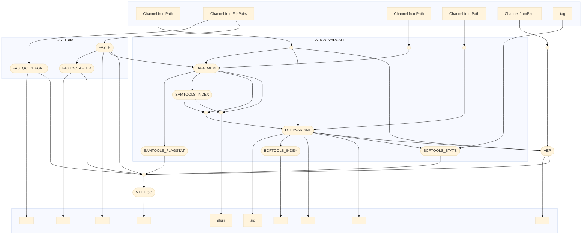

# varcallannotate
Nextflos pipeline for variat calling and annotation

[Instruction](https://docs.google.com/document/d/11jPyh1NyD_TsrZC6RyAPUcdcDu9lFdHw2Kj4nD7wyvw/edit?pli=1&tab=t.0#heading=h.4ikn9g84g3gq)

## Pipeline Main Steps

- Quality Control: FastQC
- Trimming: Fastp
- Alignment: BWA MEM
- Variant Calling: DeepVariant
- Annotation: VEP (Variant Effect Predictor)

